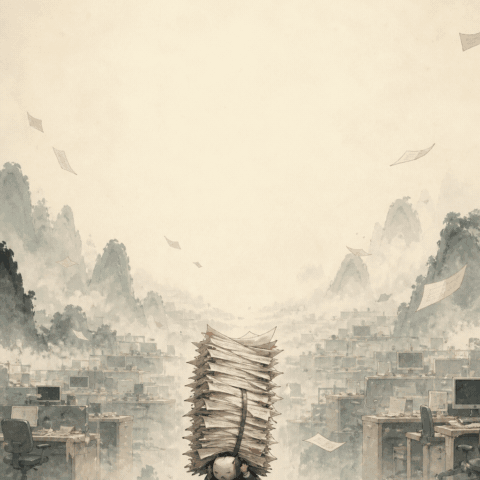
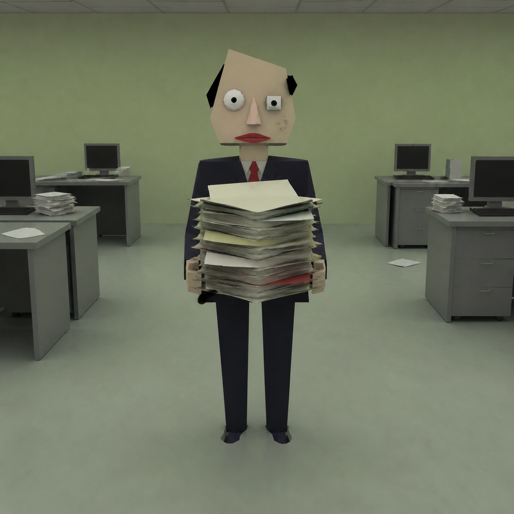

# Open NiuLai

[](https://github.com/undefinted/open-niulai/actions/workflows/ci.yml)
[](LICENSE)

> 万物皆可来。输入一个想法，得到一套能制作、能发布的原创《X来》短片方案。

**在线演示：** [http://43.138.0.110/](http://43.138.0.110/)

**运行状态：** [http://43.138.0.110/api/health](http://43.138.0.110/api/health)

在线服务部署在腾讯云按量计费实验环境中，实验结束或云服务器停机时可能暂时无法访问。

Open NiuLai 是一个 Codex Skill，也是一条面向 AI 短视频的内容生产工作流。它把一句 `猫来`、`甲方来` 或更完整的创意 prompt，扩写为剧本、角色设定、分镜、图片提示词、Runway/Kling/Seedance/MiniMax H3 视频提示词、字幕和发布文案。

它不复刻《牛来》的角色、镜头或台词。项目提炼的是一种更通用的互联网创作语法：真诚、粗糙、低成本、反差强烈、适合二创。



## 一句话到两种世界

| 骗人海报 | 崩坏正片 |
| --- | --- |
|  |  |

同一个原创 prompt：`甲方抱着第 18 版需求，说“最后改一次”`。海报负责让人停下来，正片负责让人转发。

## 七个可生产 Demo

| 题材 | 角色参考 | 图生视频首帧 | 海报 |
| --- | --- | --- | --- |
| 甲方来 | [reference](assets/demo/jiafang-character-reference.png) | [first frame](assets/demo/jiafang-footage.png) | [poster](assets/demo/jiafang-poster.png) |
| 猫来 | [reference](assets/demo/mao-character-reference.png) | [first frame](assets/demo/mao-first-frame.png) | [poster](assets/demo/mao-poster.png) |
| 代码来 | [reference](assets/demo/code-character-reference.png) | [first frame](assets/demo/code-first-frame.png) | [poster](assets/demo/code-poster.png) |
| 狗来 | [reference](assets/demo/gou-character-reference.png) | [first frame](assets/demo/gou-first-frame.png) | [poster](assets/demo/gou-poster.png) |
| 老板来 | [reference](assets/demo/laoban-character-reference.png) | [first frame](assets/demo/laoban-first-frame.png) | [poster](assets/demo/laoban-poster.png) |
| 股来 | [reference](assets/demo/gu-character-reference.png) | [first frame](assets/demo/gu-first-frame.png) | [poster](assets/demo/gu-poster.png) |
| AI来 | [reference](assets/demo/ai-character-reference.png) | [first frame](assets/demo/ai-first-frame.png) | [poster](assets/demo/ai-poster.png) |

每套资产的角色不变量与路径记录在 [demo manifest](examples/demo-manifest.json)，可由视频流水线直接读取。
素材生成方式与输入边界记录在 [demo provenance](docs/DEMO_PROVENANCE.md)。

《猫来》现已包含一次真实本地 SVD 推理生成的 [原始 AI 视频](assets/demo/mao-lai-svd.ai-video.mp4) 与 [带字幕版](assets/demo/mao-lai-svd-captioned.mp4)。模型 revision、参数、媒体探测和输入/输出哈希记录在 [可验证 provenance](assets/demo/mao-lai-svd.ai-video.provenance.json)。

## 为什么不是另一个风格提示词仓库

| 风格提示词仓库 | Open NiuLai |
| --- | --- |
| 输出一段视觉 prompt | 输出完整内容包 |
| 重点是“像” | 重点是“做得出来、发得出去” |
| 单张图或单镜头 | 剧本、图片、视频、剪辑、发布闭环 |
| 固定动物梗 | 动物、职场、开发者、财经、AI 等“万物来”题材 |

## 30 秒上手

在 Codex 中：

```text
使用 $open-niulai 做《甲方来》：15 秒职场短剧，主角抱着第 18 版需求，台词必须有“最后改一次”。生成正片截图，并给我可灵和即梦的视频提示词。
```

统一 CLI 直接建立可恢复的制作项目：

```bash
open-niulai create "做《甲方来》，抱着第18版需求" --required-line "最后改一次" --duration 5 --out projects/jiafang-lai
```

它会输出内容包、制作单、四类图片 prompt、三套视频作业和发布文案。生成图片后通过 `attach-asset` 登记，项目状态随真实资产推进。完整命令见 [CLI 文档](docs/CLI.md)。

生成供应商视频作业包和本地 MP4 动效预览：

```bash
python scripts/build_video_job.py --demo mao-lai --provider runway --duration 5 --out-dir work/mao-runway --render-preview
```

预览用于验证裁切、时长和字幕时间轴，不冒充 AI 视频成片；`video-job.json` 才是后续真实视频适配器的输入。

MiniMax H3 作业包可通过 `--provider minimax-h3` 生成。该命令默认不提交付费任务，实际成片需要在仓库外安全配置 API 密钥并显式提交；当前演示视频仍如实标注为本地 SVD 生成。详见 [MiniMax H3 接入说明](docs/MINIMAX_H3.md)。

`open-niulai generate-video --project <目录>` 默认只做不产生费用的 dry run。设置本地 `RUNWAYML_API_SECRET` 后，增加显式 `--submit` 才会提交真实生成任务；任务 ID 会立即落盘，超时重试默认恢复原任务，成片通过媒体检查后才进入完成状态。详见 [Runway 接入说明](docs/RUNWAY.md)。

没有视频 API 凭据时，也可使用 [本地 SVD 后端](docs/LOCAL_VIDEO.md) 将首帧真正动画化。它需要约 8 GB 显存、较大的模型缓存，以及操作者明确接受第三方模型许可证；默认只做 dry run。

先运行 `open-niulai doctor` 可检查 FFmpeg、Runway 配置、本地依赖、CUDA 与 SVD 管线导入；诊断不会显示密钥、下载模型或提交任务。

## 默认交付

- 原创标题、钩子、角色与世界设定
- 5 秒、15 秒或 30 秒可执行脚本
- 骗人海报、正片崩坏截图、角色参考、表情包提示词
- Runway、Kling、Seedance、MiniMax H3 四套镜头提示词
- 字幕、旁白、剪辑建议
- 标题、封面字、首评问题和标签
- `constraint_report`，明确列出用户要求是否进入产物
- 角色身份锁定协议，约束海报、首帧与视频中的轮廓、配色、面部、道具和固定破损

## 内容模板

- `ad_hook`：三秒进入冲突，适合短视频首发
- `mama_hook`：缓慢抬头与重复呼喊，只在用户接受时使用
- `rebirth_shortdrama`：重生、词条、危机、断章
- `poster_vs_footage`：精致海报硬切粗糙正片
- `budget_remake`：同一原创设定的低预算与高预算对照
- `meme_reaction`：单表情、单字幕、最小动作

## 项目结构

```text
open-niulai/
├── SKILL.md
├── agents/openai.yaml
├── references/       # 剧本、视觉、视频与增长工作流
├── scripts/          # 可复用内容包生成器
├── tests/            # 确定性行为测试
├── examples/         # 可直接查看的演示内容包
└── docs/PLAN.md      # 产品、工程和增长路线图
```

## 安装

将仓库目录复制到 Codex Skills 目录，或仅复制 `SKILL.md`、`agents/`、`references/` 与 `scripts/`：

```text
~/.codex/skills/open-niulai/
```

重新打开任务后，可以通过 `$open-niulai` 显式调用；描述匹配时也可自动触发。

CLI 可从仓库构建或安装：

```bash
python -m pip install .
open-niulai --help
```

## 产品路线

MVP 已覆盖文本生产、直接图片工作流、多视频后端导出，以及 Runway 与本地 SVD 的真实生成适配器。《猫来》真实模型成片已通过媒体、来源与哈希门禁；详细优先级、增长实验与成功指标见 [docs/PLAN.md](docs/PLAN.md)。

## 增长实验

七个首发题材及 A/B 阈值记录在 [campaign manifest](experiments/campaign.json)，生成后的完整内容包位于 [campaign packs](examples/campaign-packs/index.json)。[增长实验说明](docs/GROWTH_EXPERIMENTS.md) 提供真实平台快照记录和自动判定流程；生产事件表默认只有表头，不包含演示或估算数据。

## 权利边界

- 不提供原电影角色、标识、截图、逐镜头或逐句复刻。
- 不将真实品牌、名人或其他 IP 包装为官方合作。
- 推荐使用“原创低成本真诚崩坏 3D 动画”描述，避免宣传为官方《牛来》续作。
- `#牛来二创` 仅作为语境标签建议，发布者应结合平台规则和实际内容自行判断。

## License

MIT。生成内容仍需遵守所用模型、素材与发布平台的条款。

贡献前请阅读 [CONTRIBUTING.md](CONTRIBUTING.md) 与 [原创/IP政策](docs/IP_POLICY.md)。首发文案和七个 demo 队列见 [Launch Kit](docs/LAUNCH.md)。
